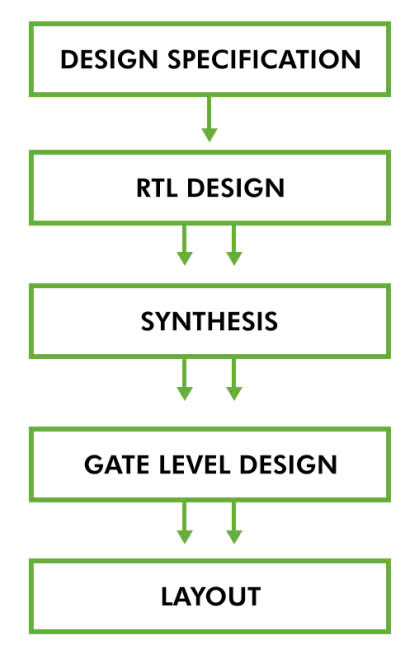
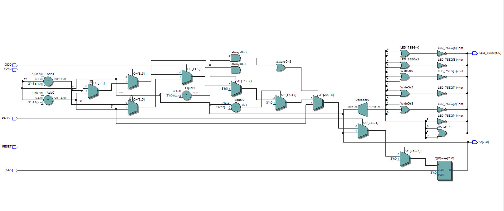
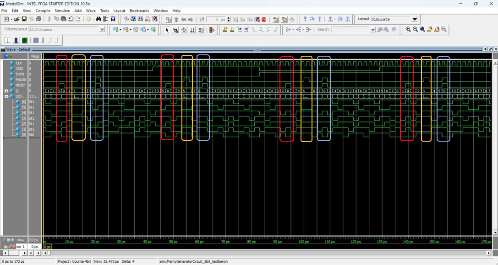
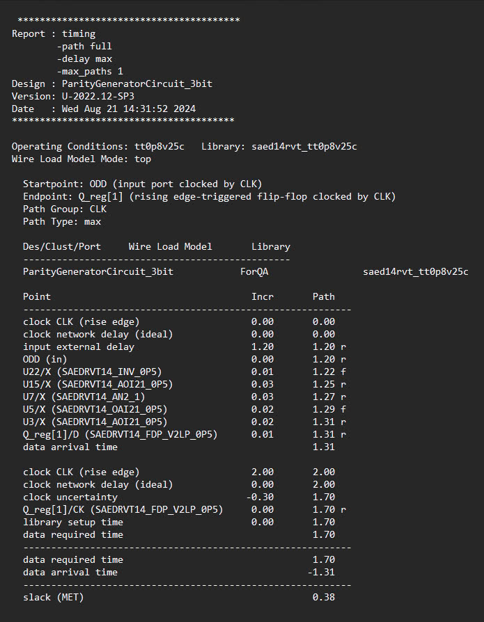
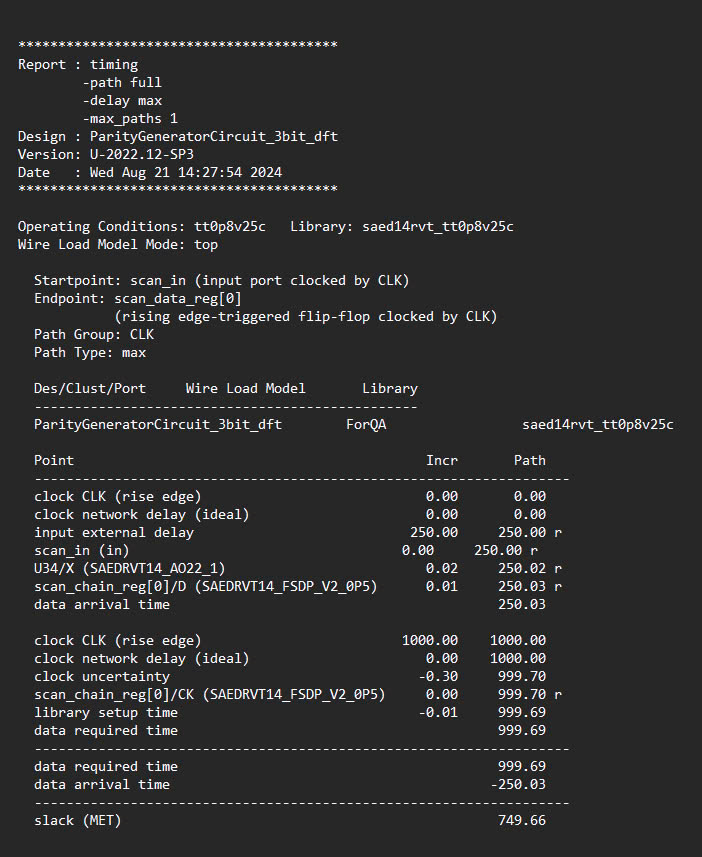
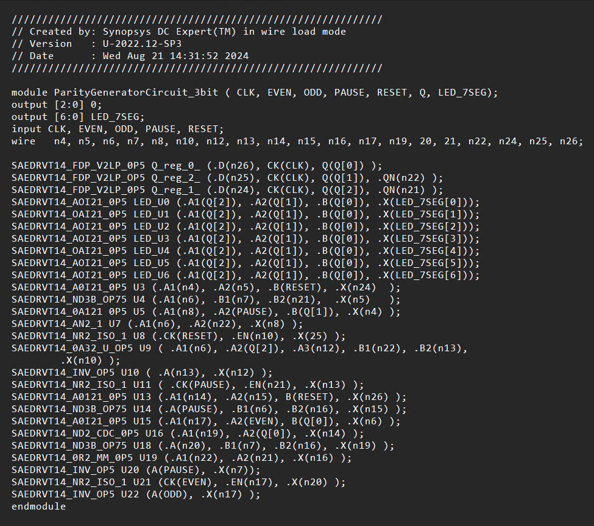
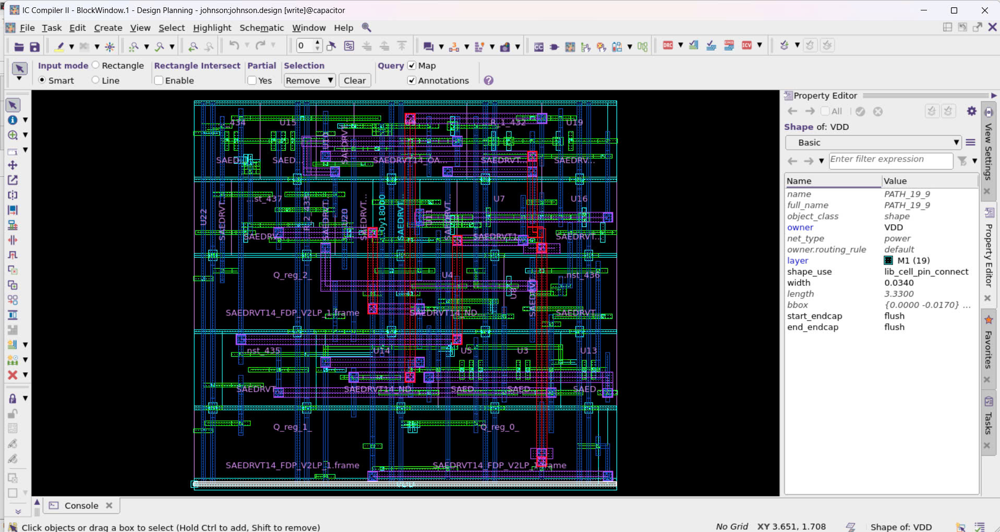

# DESIGN PARITY COUNTER GENERATOR CIRCUIT 3-BIT ACCORDING TO DIGITAL IC DESIGN FLOW

## INTRODUCTION
  - A counter goes up to (1 or 2 bit) each time rising edge clock signal and displays on led 7 segment.
  - Be affected when one of these control signals active HIGH.

  - This project folows the steps below:

  Tools requirement: 
  -  Quartus
  -  ModelSim
  -  Design Compiler
  -  ICC2 Compiler

## DIGITAL IC DESIGN FLOW
### Step 1: DESIGN SPECIFICATION
  - Define the requirements and objectives of the circuit. 
  - Describe what the circuit is supposed to do.

    (Details in file: DesignSpecification.pdf)
    
### Step 2: RTL DESIGN
  - Translate the design specifications into a high-level representation of the circuit using a hardware description language.
  - Check syntax errors.

 (Details in file: ParityGeneratorCircuit_3bit.v)
 
### Step 3: SYNTHESIS

 - Convert code into a circuit.
 - Translate an abstract design into a properly implemented chip.
 - Testbench:
   
 
 
 At the time 0 - 41ps:
 

 - Input ODD = 0, EVEN = 0 (normal counting 0,1,2,3,4,5,6,7)
   
 - When Reset = 1 (first red square): The counter turns back 0 (Q(n) = 3, Q(n+1) = 0, LED_7SED(n)= 1111001 ,LED_7SEG(n+1)= 1111110)
   
 - When Pause = 1 (first yellow square): The counter keeps the value in previous (Q(n) = 2, Q(n+1) = 2, LED_7SED(n)= 1101101 ,LED_7SEG(n+1)= 1101101)
   
 - When Reset = 1, Pause = 1 (first blue square): The counter turns back 0 (Q(n) = 5, Q(n+1) = 0, LED_7SED(n)= 1101101 ,LED_7SEG(n+1)= 1101101)
   
 At the time 41 - 88ps:

 
 - Input ODD = 1, EVEN = 0 (counting odd number: 1,3,5,7)
   
 - When Reset = 1 (second red square): The counter turns back 0 (Q(n) = 5, Q(n+1) = 0, LED_7SED(n)= 1011011 ,LED_7SEG(n+1)= 1111110)
   
 - When Pause = 1 (second yellow square): The counter keeps the value in previous  (Q(n) = 5, Q(n+1) = 5, LED_7SED(n)= 1011011 ,LED_7SEG(n+1)= 1011011)
   
 - When Reset = 1, Pause = 1 (second blue square): The counter turns back 0 (Q(n) = 0, Q(n+1) = 0, LED_7SED(n)= 1111110 ,LED_7SEG(n+1)= 1111110)
   
At the time 88 - 129ps:

- Input  ODD = 0, EVEN = 1 (counting even number: 0,2,4,6)

 - When Reset = 1 (third red square): The counter turns back 0 (Q(n) = 2, Q(n+1) = 0, LED_7SED(n)= 1101101 ,LED_7SEG(n+1)= 1111110)
   
 - When Pause = 1 (third yellow square): The counter keeps the value in previous  (Q(n) = 6, Q(n+1) = 6, LED_7SED(n)= 1011111 ,LED_7SEG(n+1)= 1011111)
   
 - When Reset = 1, Pause = 1 (third blue square): The counter turns back 0 (Q(n) = 2, Q(n+1) = 0, LED_7SED(n)= 1101101 ,LED_7SEG(n+1)= 1111110)

At the time 129 - 172ps:

- Input  ODD = 1, EVEN = 1 (normal counting 0,1,2,3,4,5,6,7)

 - When Reset = 1 (fourth red square): The counter turns back 0 (Q(n) = 1, Q(n+1) = 0, LED_7SED(n)= 0110000 ,LED_7SEG(n+1)= 1111110)
   
 - When Pause = 1 (fourth yellow square): The counter keeps the value in previous  (Q(n) = 3, Q(n+1) = 3, LED_7SED(n)= 1111001 ,LED_7SEG(n+1)= 1111001)
   
 - When Reset = 1, Pause = 1 (fourth blue square): The counter turns back 0 (Q(n) = 5, Q(n+1) = 0, LED_7SED(n)= 1011011 ,LED_7SEG(n+1)= 1111110)

 (Details in file: ParityGeneratorCircuit_3bit_testbench.v)
 
 - Design for test:

   
Perform scan synthesis.

Dictate the appropriate scan cells to insert during optimization.

Be selected is used on all modules of design.

 (Details in file: ParityGeneratorCircuit_3bit_dft.v)
 
- Timing Constraints:

Ensure that a design meets the desired timing goals.

Optimize the design in terms of either area or timing.

(Details in file: ParityGeneratorCircuit_3bit.sdc)

Design Compiler can generate numerous reports on the results of design synthesis and optimization:

- Reports for circuit: 

 

- Reports for circuit after design for test: 
  

### Step 4: GATE LEVEL DESIGN
- Emerge after doing step 3
- A textual description of a design circuit.
- Produce the  layout of the chip.
 
 

### Step 5: LAYOUT
- Convert the gate-level netlist into a physical layout
- DRC/LVS: Verify the physical layout against the design rules

 
